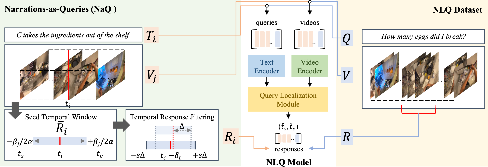

# Narrations-as-Queries (NaQ)
This repository contains the official PyTorch implementation for our CVPR 2023 paper:


<p align="justify">
<a href="https://arxiv.org/pdf/2301.00746.pdf">NaQ: Leveraging Narrations as Queries to Supervise Episodic Memory</a><br>
Santhosh Kumar Ramakrishnan<sup>1</sup> &nbsp&nbsp&nbsp&nbsp&nbsp&nbsp Ziad Al-Halah<sup>2</sup> &nbsp&nbsp&nbsp&nbsp&nbsp&nbsp Kristen Grauman<sup>1,3</sup><br>
<i><sup>1</sup>The University of Texas at Austin &nbsp&nbsp&nbsp&nbsp&nbsp&nbsp <sup>2</sup>University of Utah &nbsp&nbsp&nbsp&nbsp&nbsp&nbsp <sup>3</sup>FAIR, Meta AI</i> <br>
Project website: <a href="http://vision.cs.utexas.edu/projects/naq">http://vision.cs.utexas.edu/projects/naq</a>
</p>

## Abstract

Searching long egocentric videos with natural language
queries (NLQ) has compelling applications in augmented
reality and robotics, where a fluid index into everything
that a person (agent) has seen before could augment human
memory and surface relevant information on demand. However, the structured nature of the learning problem (freeform text query inputs, localized video temporal window
outputs) and its needle-in-a-haystack nature makes it both
technically challenging and expensive to supervise. We introduce Narrations-as-Queries (NaQ), a data augmentation
strategy that transforms standard video-text narrations into
training data for a video query localization model. Validating our idea on the Ego4D benchmark, we find it has
tremendous impact in practice. NaQ improves multiple top
models by substantial margins (even doubling their accuracy), and yields the very best results to date on the Ego4D
NLQ challenge, soundly outperforming all challenge winners in the CVPR and ECCV 2022 competitions and topping
the current public leaderboard. Beyond achieving the stateof-the-art for NLQ, we also demonstrate unique properties
of our approach such as the ability to perform zero-shot and few-shot NLQ, and improved performance on queries about long-tail object categories.



# Installation

* Clone this repository.
    ```
    git clone https://github.com/srama2512/NaQ.git
    export NAQ_ROOT=<PATH to cloned NaQ repository>
    ```

* Create a conda environment.
    ```
    conda create --name naq python=3.8.5
    conda activate naq
    ```
* Install Pytorch. While our experiments use cuda 11.3, we expect other supported versions to work as well.
    ```
    conda install pytorch==1.11.0 torchvision==0.12.0 torchaudio==0.11.0 cudatoolkit=11.3 -c pytorch
    ```
* Install other dependencies.
    ```
    cd $NAQ_ROOT; pip install -r requirements.txt
    ```
* Create a setup script `~/enable_naq.sh` with the content below (and set appropriate paths). This sets up environment variables for NaQ experiments.
    ```
    #!/bin/bash

    # Add anaconda path
    export PATH="$PATH:<PATH TO ANACONDA INSTALLATION>/bin"
    # Activate conda environment
    source activate naq

    # Add cuda, cudnn paths
    export CUDA_HOME="<PATH TO CUDA-11.3>"
    export CUDNN_PATH="<PATH TO CUDNN compatibile with CUDA-11.3>"
    export CUDNN_INCLUDE_DIR="$CUDNN_PATH/include"
    export CUDNN_LIBRARY="$CUDNN_PATH/lib"
    export CUDACXX="$CUDA_HOME/bin/nvcc"

    export NAQ_ROOT="<PATH TO CLONED NAQ REPOSITORY>"
    ```

# Dataset setup
* Download `v1` version of the Ego4D episodic memory annotations following the [official instructions](https://ego4d-data.org/docs/start-here/) and copy them to `$NAQ_ROOT/data/(nlq|vq|moments)_*.json`. For experiments on TaCOS, we provide reformatted TaCOS annotations [here](https://utexas.box.com/s/4vmzxjf21gs7uxgg5xg4nmfh1sw5drm3) compatible for NLQ training. Download them to `$NAQ_ROOT/data/tacos_*.json`.
* Prepare the NaQ datasets following instructions [here](PREPARE_NAQ_DATASETS.md).
* Download video features for all clips used in the experiments. These are computed using the official checkpoints released for each method.

    | Features                                                             |        Destination                          | Description                                          | Dim   |  Size  |
    |:--------------------------------------------------------------------:|:-------------------------------------------:|:----------------------------------------------------:|:-----:|:------:|
    | [SlowFast](https://github.com/facebookresearch/SlowFast)             | `$NAQ_ROOT/data/features/slowfast`          | 8x8 R101 backbone trained on Kinetics 400            | 2304  | 160G   |
    | [EgoVLP](https://github.com/showlab/EgoVLP)                          | `$NAQ_ROOT/data/features/egovlp`            | TimeSformer backbone trained on EgoClip              |  256  |  6G    |
    | [InternVideo](https://github.com/OpenGVLab/ego4d-eccv2022-solutions) | `$NAQ_ROOT/data/features/internvideo`       | D+A prefusion of VideoMAE backbones trained on Ego4D | 2304  | 41G    |
    | [CLIP](https://github.com/openai/CLIP)                               | `$NAQ_ROOT/data/features/clip`              | ViT-B/16 backbone pre-trained using CLIP             |  512  |  6G    |

    We provide a downloader to download, extract, and move features to the corresponding destinations: <br>
    ```
    python utils/download_features.py --feature_types <FEAT_TYPE_1> <FEAT_TYPE_2> ...
    ```
    where `FEAT_TYPE` can be `slowfast`, `egovlp`, `clip` or `internvideo`. Based on our experiments, we recommend using InternVideo features for Ego4D and SlowFast features for TaCOS to get the best results


# Benchmarking models on NLQ

We perform NaQ training in two stages: (1) Jointly train on NLQ+NaQ dataset with large-batch training, and (2) Finetune on NLQ dataset with standard VSLNet training. We show an example below to benchmark models on the Ego4D NLQ dataset with EgoVLP features.

## VSLNet

**Stage 1:** Joint training on NLQ+NaQ dataset
```
cd $NAQ_ROOT
bash VSLNet/scripts/train_naq.sh 0,1,2,3 nlq egovlp experiments/vslnet/egovlp/naq_joint_training 2.5
```
**Stage 2:** Fine-tune best checkpoint from stage-1 on NLQ dataset
```
cd $NAQ_ROOT
PRETRAINED_CKPT=experiments/vslnet/egovlp/naq_joint_training/checkpoints/vslnet_nlq_aug_naq_official_v1_egovlp_128_bert/model/<checkpoint_id>.t7
bash VSLNet/scripts/finetune.sh 0 nlq egovlp experiments/vslnet/egovlp/nlq_finetuning 0.0001 $PRETRAINED_CKPT
```

**Inference:**
```
cd $NAQ_ROOT
bash VSLNet/scripts/infer.sh 0 nlq test egovlp experiments/vslnet/egovlp/nlq_finetuning
```
For participating in the Ego4D NLQ challenge, submit the inferred predictions at `experiments/vslnet/egovlp/nlq_finetuning/checkpoints/vslnet_nlq_official_v1_egovlp_128_bert/model/<checkpoint_id>_test_result.json`.

## ReLER training

**Stage 1:** Joint training on NLQ+NaQ dataset
```
cd $NAQ_ROOT
bash ReLER/scripts/train_naq.sh 0,1,2,3,4,5,6,7 nlq egovlp experiments/reler/egovlp/naq_joint_training 2.5
```

**Stage 2:** Fine-tune best checkpoint from stage-1 on NLQ dataset
```
cd $NAQ_ROOT
PRETRAINED_CKPT=experiments/reler/egovlp/naq_joint_training/video_tef-vlen600_egovlp/model_<checkpoint_id>.t7
bash ReLER/scripts/finetune.sh 0 nlq egovlp experiment/reler/egovlp/nlq_finetuning 0.00001 $PRETRAINED_CKPT
```

**Inference:**
```
cd $NAQ_ROOT
bash ReLER/scripts/infer.sh 0 test egovlp experiments/reler/egovlp/nlq_finetuning/video_tef-vlen600_egovlp/model_<checkpoint_id>.t7
```
For participating in the Ego4D NLQ challenge, submit the inferred predictions at `experiments/reler/egovlp/nlq_finetuning/video_tef-vlen600_egovlp/preds/<checkpoint_id>_test_preds.json`.

To train on SlowFast / InternVideo features, replace `egovlp` with `slowfast` or `internvideo` above. To train on TaCOS, replace `nlq` with `tacos`.

## Pretrained models
We provide models pretrained using NaQ for different combinations of architectures and features [here](https://utexas.box.com/s/qer95g7tvxbaf8wih8cz727byq3dwxxm). These checkpoints can be used to reproduce results from the paper.


# Ego4D NLQ 2023 challenge

* Download `v2` version of the Ego4D episodic memory annotations following the [official instructions](https://ego4d-data.org/docs/start-here/) and copy them to `$NAQ_ROOT/data/(nlq|vq|moments)_<SPLIT>_v2.json`.

* Download the pre-created NaQ dataset for `v2` version following instructions [here](PREPARE_NAQ_DATASETS.md). This should have already been downloaded if you followed option 1. Alternatively, perform follow the next steps.

    * Convert EgoClip narrations to NaQ dataset.
        ```
        cd $NAQ_ROOT
        python utils/create_naq_dataset.py --type nlq --em_version v2
        ```
    * Prepare datasets for NLQ training.
        ```
        cd $NAQ_ROOT
        # Prepare NLQ dataset
        python utils/prepare_ego4d_dataset.py \
            --input_train_split data/nlq_train_v2.json \
            --input_val_split data/nlq_val_v2.json \
            --input_test_split data/nlq_test_unannotated_v2.json \
            --output_save_path data/dataset/nlq_official_v2

        # Prepare NLQ + NaQ dataset
        python utils/prepare_ego4d_dataset.py \
            --input_train_split data/nlq_aug_naq_train_v2.json \
            --input_val_split data/nlq_val_v2.json \
            --input_test_split data/nlq_test_unannotated_v2.json \
            --output_save_path data/dataset/nlq_aug_naq_official_v2
        ```
    * The video features for the challenge clips are included in the files downloaded in the earlier section.
* We found that the combination of ReLER architecture + InternVideo features + NaQ augmentation performed best on the v2 validation split (we call this NaQ++). This combination is set as the official baseline for the [Ego4D NLQ 2023 challenge](https://eval.ai/web/challenges/challenge-page/1629/overview).

    **Stage 1:** Joint training on NLQ+NaQ dataset
    ```
    cd $NAQ_ROOT
    bash ReLER/scripts/train_naq.sh 0,1,2,3,4,5,6,7 nlq_v2 internvideo experiments/challenge_2023/reler_internvideo/naq_joint_training 5.0
    ```
    **Stage 2:** Fine-tune best checkpoint from stage-1 on NLQ dataset
    ```
    cd $NAQ_ROOT
    PRETRAINED_CKPT=experiments/challenge_2023/reler_internvideo/naq_joint_training/video_tef-vlen600_internvideo/model_<checkpoint_id>.t7
    bash ReLER/scripts/finetune.sh 0 nlq_v2 internvideo experiments/challenge_2023/reler_internvideo/nlq_finetuning 0.0001 $PRETRAINED_CKPT
    ```
    **Inference:**
    ```
    cd $NAQ_ROOT
    bash ReLER/scripts/infer.sh 0 test internvideo experiments/challenge_2023/reler_internvideo/nlq_finetuning/video_tef-vlen600_internvideo/model_<checkpoint_id>.t7
    ```
    **Submission:** Submit the inferred predictions at `experiments/challenge_2023/reler_internvideo/nlq_finetuning/video_tef-vlen600_internvideo/preds/<checkpoint_id>_test_preds.json`.

    **Pretrained-models:** We provide pre-trained weights for NaQ++ below. Note that we also include a checkpoint for the VSLNet architecture.

    |                | Val MR@1   | Val MR@5 | Test MR@1 | Test MR@5 |
    |----------------|:----------:|:--------:|:-----------:|:-----------:|
    | [NaQ++ (VSLNet)](https://utexas.box.com/s/ivv7qsy8w1w0q6w49pjzwgih4hehtrfm) |  16.02     |  28.46   |   13.96   |   21.78   |
    | [NaQ++ (ReLER)](https://utexas.box.com/s/mhpp9tga3ks1lkhgo3j9kkh51pdrz8y9)  |  18.75     |  24.24   |   17.67   |   20.72   |


# References
Please cite our work if you find our augmentation technique or this codebase useful.
```
@inproceedings{ramakrishnan2023naq,
    author       = {Ramakrishnan, Santhosh K. and Al-Halah, Ziad and Grauman, Kristen},
    booktitle    = {Computer Vision and Pattern Recognition (CVPR), 2023 IEEE Conference on},
    title        = {NaQ: Leveraging Narrations as Queries to Supervise Episodic Memory},
    year         = {2023},
    organization = {IEEE},
}
```

We also encourage you to cite these other references depending on whether you use the corresponding dataset, features or architecture.
```
# Ego4D dataset
@inproceedings{grauman2022ego4d,
  title={Ego4d: Around the world in 3,000 hours of egocentric video},
  author={Grauman, Kristen and Westbury, Andrew and Byrne, Eugene and Chavis, Zachary and Furnari, Antonino and Girdhar, Rohit and Hamburger, Jackson and Jiang, Hao and Liu, Miao and Liu, Xingyu and others},
  booktitle={Proceedings of the IEEE/CVF Conference on Computer Vision and Pattern Recognition},
  pages={18995--19012},
  year={2022}
}

# SlowFast features
@inproceedings{feichtenhofer2019slowfast,
  title={Slowfast networks for video recognition},
  author={Feichtenhofer, Christoph and Fan, Haoqi and Malik, Jitendra and He, Kaiming},
  booktitle={Proceedings of the IEEE/CVF international conference on computer vision},
  pages={6202--6211},
  year={2019}
}

# EgoVLP features
@inproceedings{linegocentric,
  title={Egocentric Video-Language Pretraining},
  author={Lin, Kevin Qinghong and Wang, Jinpeng and Soldan, Mattia and Wray, Michael and Yan, Rui and Xu, Eric Zhongcong and Gao, Denial and Tu, Rong-Cheng and Zhao, Wenzhe and Kong, Weijie and others},
  booktitle={Advances in Neural Information Processing Systems},
  year={2022}
}

# InternVideo features
@article{chen2022ego4d,
  title={InternVideo-Ego4D: A Pack of Champion Solutions to Ego4D Challenges},
  author={Chen, Guo and Xing, Sen and Chen, Zhe and Wang, Yi and Li, Kunchang and Li, Yizhuo and Liu, Yi and Wang, Jiahao and Zheng, Yin-Dong and Huang, Bingkun and others},
  journal={arXiv preprint arXiv:2211.09529},
  year={2022}
}

# CLIP features
@inproceedings{radford2021learning,
  title={Learning transferable visual models from natural language supervision},
  author={Radford, Alec and Kim, Jong Wook and Hallacy, Chris and Ramesh, Aditya and Goh, Gabriel and Agarwal, Sandhini and Sastry, Girish and Askell, Amanda and Mishkin, Pamela and Clark, Jack and others},
  booktitle={International conference on machine learning},
  pages={8748--8763},
  year={2021},
  organization={PMLR}
}

# VSLNet architecture
@inproceedings{zhang2020span,
    title = "Span-based Localizing Network for Natural Language Video Localization",
    author = "Zhang, Hao  and Sun, Aixin  and Jing, Wei  and Zhou, Joey Tianyi",
    booktitle = "Proceedings of the 58th Annual Meeting of the Association for Computational Linguistics",
    month = jul,
    year = "2020",
    address = "Online",
    publisher = "Association for Computational Linguistics",
    url = "https://www.aclweb.org/anthology/2020.acl-main.585",
    pages = "6543--6554"
}

# ReLER architecture
@article{liu2022reler,
  title={ReLER@ ZJU-Alibaba Submission to the Ego4D Natural Language Queries Challenge 2022},
  author={Liu, Naiyuan and Wang, Xiaohan and Li, Xiaobo and Yang, Yi and Zhuang, Yueting},
  journal={arXiv preprint arXiv:2207.00383},
  year={2022}
}
```
